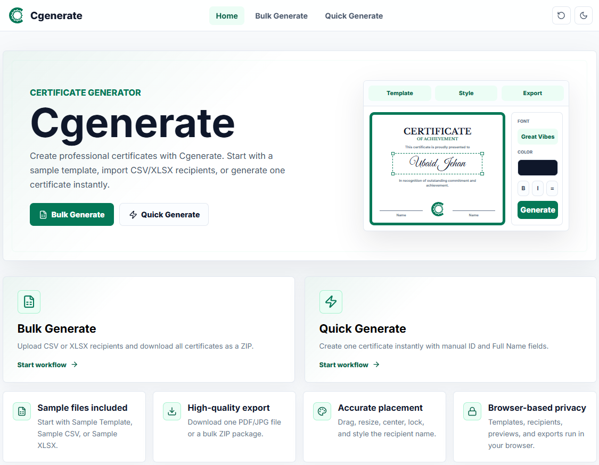

  

<h1 align="center">Cgenerate</h1>

  Free Online Certificate Generator & Bulk Certificate Creator

  Create professional certificates online in seconds from Excel, CSV, PNG, JPG, and PDF templates.

  🌐 <a href="https://cgenerate.com">Official Website</a>

---

## Preview

---

## About Cgenerate

Cgenerate is a modern online certificate generation platform that helps educational institutions, organizations, businesses, and event managers create professional certificates quickly and efficiently.

Whether you need a single certificate or thousands of certificates, Cgenerate provides a fast, reliable, and professional solution directly from your browser.

### Ideal For

- Schools
- Colleges
- Universities
- Training Institutes
- Workshops
- Webinars
- Conferences
- Organizations
- Event Managers
- Businesses

---

## Key Features

### Quick Certificate Generator

Generate individual certificates with complete control over text placement, styling, and formatting.

### Bulk Certificate Generator

Generate hundreds or thousands of certificates using Excel (XLSX) or CSV files.

### Custom Certificate Templates

Upload and use your own certificate templates while preserving original quality and design.

### Excel & CSV Import

Import recipient data directly from spreadsheet files.

### Multiple Export Formats

- PDF Export
- JPG Export

### ZIP Package Download

Download multiple certificates as a single ZIP archive.

### Browser-Based Platform

No installation required. Access Cgenerate from any device and browser.

---

## Available Tools

### Quick Certificate Generator

https://cgenerate.com/quick-certificate-generator/

Create professional certificates instantly by uploading a template and entering recipient details.

### Bulk Certificate Generator

https://cgenerate.com/bulk-certificate-generator/

Generate certificates in bulk using Excel or CSV recipient lists.

---

## Popular Use Cases

- Student Certificates
- Workshop Certificates
- Webinar Certificates
- Training Certificates
- Course Completion Certificates
- Participation Certificates
- Appreciation Certificates
- Achievement Certificates
- Conference Certificates
- Corporate Training Certificates

---

## Why Choose Cgenerate?

- Fast certificate generation
- Professional-quality output
- User-friendly interface
- Bulk certificate support
- Excel & CSV integration
- Secure cloud-based platform
- No software installation required
- Accessible from any device

---

## Documentation & Guides

### Certificate Template Guide

https://cgenerate.com/certificate-template-guide/

### Bulk Certificate Generation Guide

https://cgenerate.com/bulk-certificate-generation-guide/

### How to Create Certificates Online

https://cgenerate.com/how-to-create-certificates/

---

## Mission

Our mission is to simplify certificate creation by providing a fast, reliable, and professional platform for educational institutions, organizations, businesses, and event managers worldwide.

---

## Connect With Cgenerate

🌐 Website: https://cgenerate.com

🐙 GitHub: https://github.com/cgenerate

---

Powered by Cgenerate
